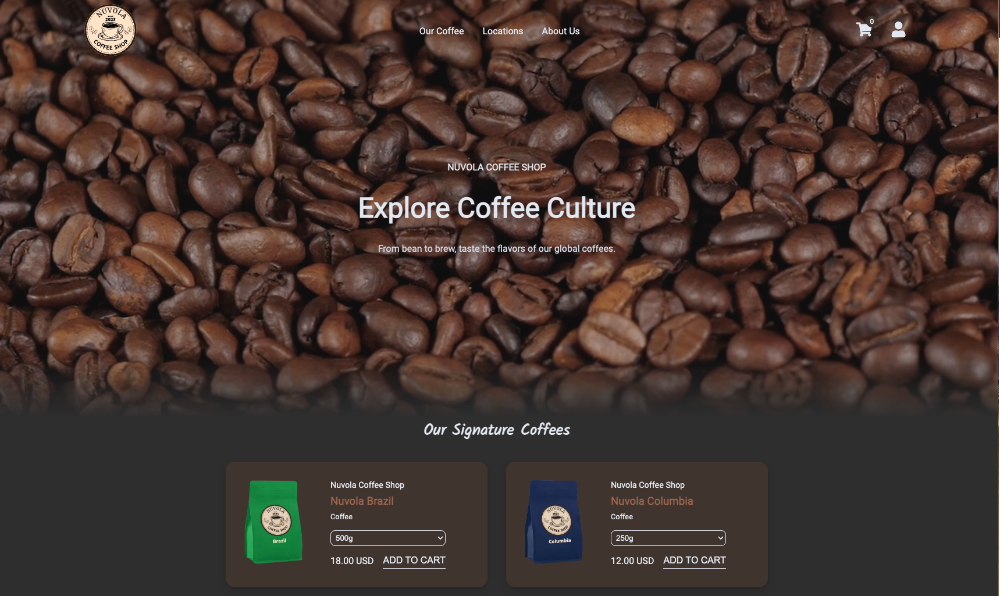

# Nuvola Coffee Shop

Nuvola Coffee Shop is an e-commerce web application designed to provide a coffee shopping experience.

[Visit the website](https://www.nuvolacoffee.store)



## Table of Contents

- [Nuvola Coffee Shop](#nuvola-coffee-shop)
  - [Table of Contents](#table-of-contents)
  - [Features](#features)
  - [Tech Stack](#tech-stack)
  - [Installation](#installation)
  - [Usage](#usage)
  - [Related Articles](#related-articles)
  - [License](#license)

## Features

- User authentication with AWS Cognito
- Secure payment processing with Stripe
- State management with Redux
- Responsive design with SCSS Modules
- Built with Next.js and TypeScript for a modern, fast, and efficient user experience

## Tech Stack

- **Framework**: Next.js
- **Language**: TypeScript
- **State Management**: Redux
- **Authentication**: AWS Cognito
- **Payment Processing**: Stripe
- **Styling**: SCSS Modules
- **Database**: PostgreSQL
- **Database Query Builder**: Kysely

## Installation

To get started with the project, follow these steps:

1. Clone the repository:

   ```bash
   git clone https://github.com/bulutyerli/nuvola-coffee-shop
   cd nuvola-coffee-shop
   ```

2. Install the dependencies:

   ```bash
   npm install
   ```

3. Set up environment variables:
   Create a `.env.local` file in the root of the project and add your environment variables.:

   ```env
   NEXT_PUBLIC_GOOGLE_API=google_api_for_maps
   NEXT_PUBLIC_RETURN_URL=stripe_payment_status_callback_url
   NEXT_PUBLIC_STRIPE_PUBLISHABLE_KEY=stripe_publishable_key
   NEXT_PUBLIC_USER_POOL_CLIENT_ID=cognito_client_id
   NEXT_PUBLIC_USER_POOL_ID=cognito_pool_id
   STRIPE_SECRET_KEY=stripe_secret_key
   STRIPE_SECRET_WEBHOOK_KEY=stripe_secret_webhook_key

   ```

   You will also need to add database credentials for postgres.
   I used vercel postgres in this project it automaticly uses credentials but
   if you use an other service you should also add db credentials into /database.ts file.

4. Run the development server:

   ```bash
   npm run dev
   ```

   Open [http://localhost:3000](http://localhost:3000) with your browser to see the result.

## Usage

- **Browse Products**: Explore coffee products and buy. There are 4 products on homepage but also in "our coffee" section.
- **User Authentication**: Sign up, sign in, and manage your account using AWS Cognito. Users should also verify their email addresses before sign in.
- **Shopping Cart**: Add items to your cart and manage your selections. Users can add items to Cart even before sign up. It stores items in local storage.
- **Account**: Users must add an delivery address in this section to be able to buy a product. They can also edit or delete their addresses.
- **Checkout**: Securely process payments using Stripe. For testing purposes you can use 4242 4242 4242 4242 credit card number to get a successfull payment result on check out page.
- **Orders**: Users can check their orders and order status in this page.
-

## Related Articles

I have written a tutorial about integrating Stripe Payment Elements with Next.js 14 App Router. It also includes Stripe webhooks. All steps are done using TypeScript. You can read this article at:

- [Integrating Stripe with Next.js 14 App Router](https://medium.com/stackademic/integrating-stripe-payment-elements-with-next-js-14-app-router-webhooks-typescript-4d6eb7710c40)

You can also find the same article on my portfolio website: [Bulutyerli.com](https://www.bulutyerli.com)

## License

This project is licensed under the MIT License. See the [LICENSE](LICENSE) file for details.
